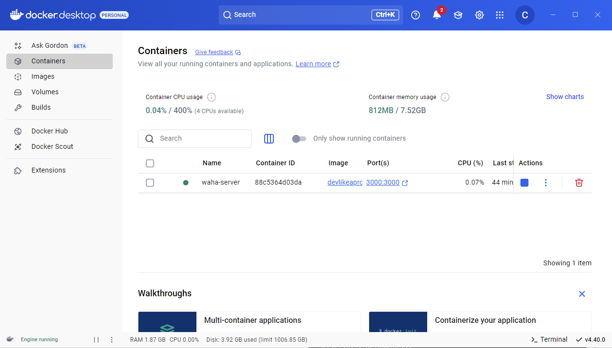
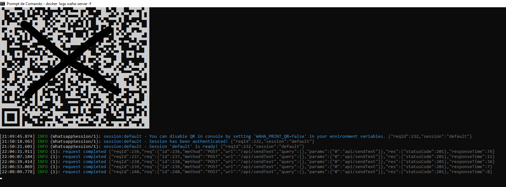
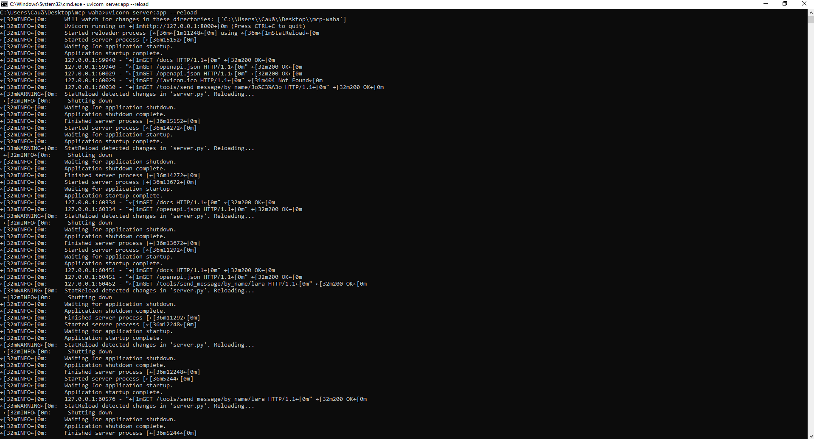
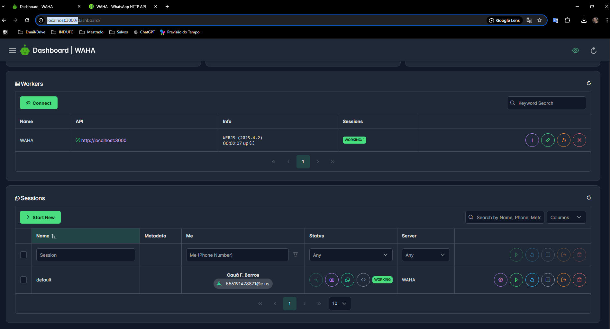
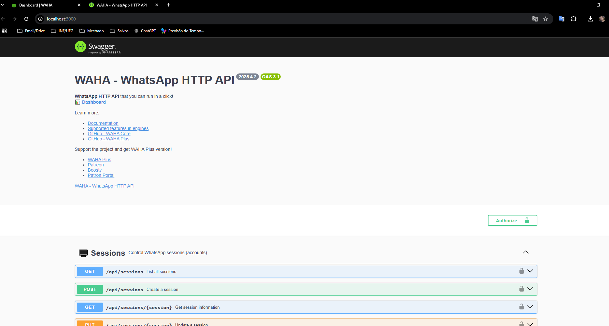

# MCP + WAHA WhatsApp Integration

Este projeto implementa um servidor MCP com uma ferramenta (`send_message`) para envio de mensagens via WhatsApp utilizando o WAHA.

## Requisitos

- Python 3.8 ou superior  
- Docker Desktop (com WSL 2 ativado)  
- Conta WhatsApp ativa em um celular  

## Instalação de dependências

```bash
pip install fastapi uvicorn requests
```

## Como rodar o servidor MCP

1. Clone ou baixe este repositório  
2. Navegue até a pasta do projeto e rode:
```bash
uvicorn server:app --reload
```
3. Acesse a interface Swagger em:  
[http://127.0.0.1:8000/docs](http://127.0.0.1:8000/docs)

## Endpoints disponíveis

- `POST /tools/send_message`: Envia mensagem para número informado  
- `GET /tools/send_message/by_name/{nome}`: Envia mensagem de bom dia para um contato  
- `GET /resources/contatos`: Lista os contatos pré-definidos  

## Como rodar o WAHA (WhatsApp HTTP API)

1. Execute no terminal:

```bash
docker pull devlikeapro/waha:latest
docker run -p 3000:3000 --name waha-server devlikeapro/waha
```

2. Acesse `http://localhost:3000`  
3. Crie uma sessão via `POST /api/sessions` com ID `default`  
4. Inicie a sessão via `PUT /api/sessions/default`  
5. Verifique o terminal com:
```bash
docker logs waha-server -f
```
6. Copie o QR Code gerado (base64) e cole no navegador para escanear com o WhatsApp Web

---

## Prints de Funcionamento

### WAHA rodando no Docker


### Acesso ao WAHA via navegador


### Swagger da API FastAPI (MCP)


### Swagger - Envio por nome


### Retorno da API


### Mensagem recebida no WhatsApp


---

## Teste final

- Acesse `http://127.0.0.1:8000/docs`  
- Teste `/tools/send_message/by_name/joao`  
- A mensagem “Bom dia, João!” será enviada via WhatsApp

---

## Autor

Cauã Ferreira Barros  
Mestrando em Ciência da Computação – UFG
