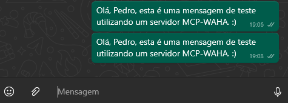

<pre> # MCP + WAHA WhatsApp Integration Este projeto implementa um servidor MCP com uma ferramenta (`send_message`) para envio de mensagens via WhatsApp utilizando o WAHA. ## ğŸ› ï¸ Requisitos - Python 3.8 ou superior - Docker Desktop (com WSL 2 ativado) - Conta WhatsApp ativa em um celular ## 📦 Instalação de dependências ```bash pip install fastapi uvicorn requests ``` ## 🚀 Como rodar o servidor MCP 1. Clone ou baixe este repositório 2. Navegue até a pasta do projeto e rode: ```bash uvicorn server:app --reload ``` 3. Acesse a interface Swagger em: ``` http://127.0.0.1:8000/docs ``` ## 🤖 Endpoints disponíveis - `POST /tools/send_message`: Envia mensagem para número informado - `GET /tools/send_message/by_name/{nome}`: Envia mensagem de bom dia para um contato - `GET /resources/contatos`: Lista os contatos pré-definidos ## 📲 Como rodar o WAHA (WhatsApp HTTP API) 1. Execute no terminal: ```bash docker pull devlikeapro/waha:latest docker run -p 3000:3000 --name waha-server devlikeapro/waha ``` 2. Acesse `http://localhost:3000` 3. Crie uma sessão via `POST /api/sessions` com ID `default` 4. Inicie a sessão via `PUT /api/sessions/default` 5. Verifique o terminal com: ```bash docker logs waha-server -f ``` 6. Copie o QR Code gerado (base64) e cole no navegador para escanear com o WhatsApp Web --- ## 📸 Prints de Funcionamento ### Docker e WAHA rodando  ### Acesso ao WAHA via navegador  ### Swagger da API FastAPI (MCP)  ### Swagger - Exemplo de envio por nome  ### Retorno da API  ### WhatsApp com mensagem recebida  --- ## ✅ Teste final - Acesse: `http://127.0.0.1:8000/docs` - Teste `/tools/send_message/by_name/joao` - A mensagem “Bom dia, João!†será enviada via WhatsApp --- ## 👨â€ğŸ’» Autor Cauã Ferreira Barros – Mestrando em Ciência da Computação – UFG </pre>